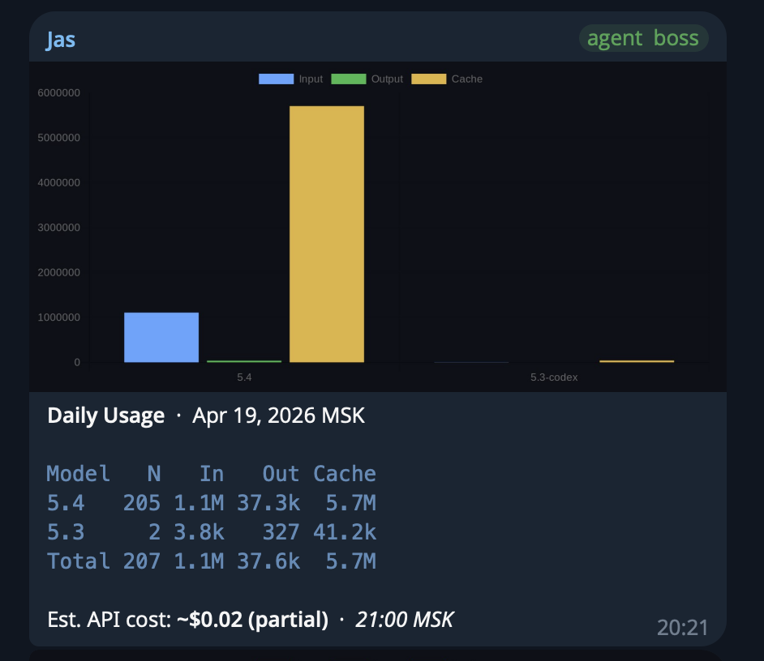
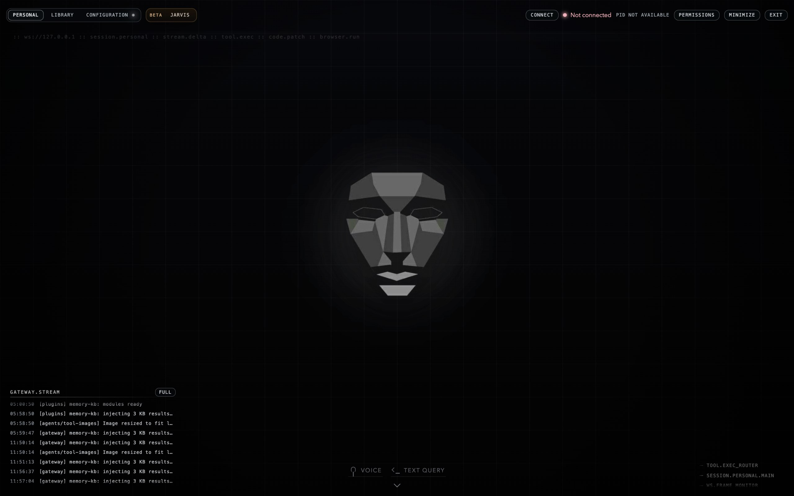

# OpenClaw Workspace

Этот репозиторий показывает мой практический слой вокруг OpenClaw: как я использовал бота в реальной работе, как была устроена Telegram-структура, как была собрана UI-оболочка и какие внутренние модули я добавлял поверх базовой инфраструктуры.

Важно:

- основа работы с ботом строилась на базе основного инфраструктурного репозитория OpenClaw;
- ссылку на original upstream я добавлю отдельно;
- остальная организация этого workspace, UI-слой, прикладные сценарии, документация и часть automation-логики собирались мной самостоятельно и в связке с языковыми моделями.

Это не зеркало upstream-репозитория. Это мой собственный рабочий слой поверх OpenClaw.

## Applied Stack

Основной стек этого workspace собран на `TypeScript` и `JavaScript` с использованием `Node.js`, `React`, `Vite`, `Electron`, `SQLite`, `@zvec/zvec`, `@huggingface/transformers`, `better-sqlite3`, `Playwright` и `Google APIs` для UI, локальной knowledge-base, automation и backup-сценариев.

Отдельно отмечу, что в работе над экосистемой я также использовал `Python` и `Go`: `Python` присутствует и в этом публичном репозитории как часть сервисных модулей, а `Go` использовался в связанных задачах вокруг проекта, хотя в текущем публичном snapshot он почти не представлен.

## Telegram Output

Один из главных способов работы с ботом был Telegram.

Основной живой контур общения шёл через личные сообщения под именем `Jas`. Там происходили постановка задач, быстрые диалоги, ручные команды и повседневная работа с агентом.

Ниже показана схема Telegram-структуры, которую я использовал на практике.

```text
Telegram
├── Jas (личные сообщения)
│   └── основной контур общения с ботом: диалоги, команды, ручные задачи и быстрые проверки
├── llm.hub
│   ├── chunks          — добавление и контроль материалов в базу знаний
│   ├── dev             — dev-сообщения, critical alerts и технические события
│   ├── jas-openai      — отдельная рабочая ветка под OpenAI-сценарии
│   ├── token-balance   — сводки по токенам, usage и модельной статистике
│   ├── jas-anthropic   — отдельная рабочая ветка под Anthropic-сценарии
│   ├── ai-summary      — краткие AI-сводки и обзорные сообщения
│   └── General         — общий служебный слой и базовая коммуникация
└── llm.trading
    ├── macro              — макро-календарь и ближайшие экономические релизы
    ├── agent-trading      — разбор рыночной картины и trading-аналитика
    ├── token-optimization — визуалы, публикации и optimization-сценарии
    ├── updates            — служебные апдейты и изменения структуры
    ├── 6551               — news/data feed и новостные сигналы
    ├── etc                — дополнительные материалы и вспомогательные публикации
    ├── links              — быстрые ссылки и связующие элементы
    ├── x-search           — поисковые и исследовательские сценарии по X/Twitter
    └── General            — общий канал/ветка для базовой структуры раздела
```

### Telegram Screenshots

- [Telegram channel structure](assets-github/tg.png)

### Token Optimization Example

Ветка `token-optimization` использовалась для публикации визуалов, оптимизации подачи и подготовки наглядных материалов для trading-сценариев.



## Root Structure

Перед схемой важно отметить ещё одну вещь: в этом workspace можно было вручную управлять тем, к чему бот имеет доступ внутри устройства.

На практике это означало, что я мог включать и отключать доступ к отдельным tool-группам через `tools.allow` / `tools.deny`, а со стороны UI дополнительно работать с системными разрешениями вроде микрофона и `media/audio capture`.

В UI это было вынесено в отдельную панель `Personal Permissions`.

### Редактируемые разрешения

- `read` — читать файлы в локальном workspace.
- `write` — создавать файлы и полностью перезаписывать существующие.
- `edit` — вносить точечные правки в файлы.
- `apply_patch` — редактировать файлы через patch/diff-операции.
- `exec` — запускать shell-команды на хостовой системе.
- `process` — просматривать и управлять фоновыми процессами.
- `web_search` — искать информацию в вебе.
- `web_fetch` — загружать и читать содержимое страниц.
- `memory_search` — делать семантический поиск по памяти.
- `memory_get` — читать сохранённые записи памяти.
- `sessions_list` — видеть список доступных сессий.
- `sessions_history` — читать историю сообщений по сессиям.
- `sessions_send` — отправлять сообщения в выбранные сессии.
- `sessions_spawn` — запускать новые sub-agent сессии.
- `sessions_yield` — получать результат работы sub-agent-задач.
- `subagents` — управлять жизненным циклом под-агентов.
- `session_status` — смотреть текущий статус сессии или запуска.
- `browser` — управлять browser automation.
- `canvas` — работать с визуальными canvas-поверхностями.
- `message` — отправлять сообщения во внешние каналы.
- `cron` — управлять периодическими задачами.
- `gateway` — управлять gateway-уровнем.
- `nodes` — работать с node/device-слоем.
- `agents_list` — просматривать список агентов.
- `image` — анализировать и обрабатывать изображения.
- `tts` — преобразовывать текст в голосовой вывод.

### Структура проекта

```text
openclaw/
├── UI/                      — визуальная оболочка бота, интерфейс и desktop-слой
│   ├── public/             — публичные ассеты, изображения и аудио для интерфейса
│   ├── electron/           — desktop-обвязка и локальный shell
│   ├── src/                — исходный код интерфейса
│   ├── scripts/            — служебные скрипты запуска и локальной интеграции
│   └── mcp/                — persistent design context для UI-итераций
├── core/                    — внутренние модули и сервисные компоненты workspace
│   ├── backup/             — резервное копирование и восстановление данных
│   ├── cron-log/           — журналирование и разбор cron-задач
│   ├── humanizer/          — слой стилизации и “очеловечивания” ответов
│   ├── knowledge-base/     — локальная knowledge base, ingest и query-логика
│   ├── model-usage-tracker/— трекинг использования моделей и отчетность
│   └── office-ui/          — отдельный вложенный UI/desktop-проект
├── assets-github/           — скриншоты и изображения для GitHub-страницы репозитория
├── councils/                — проверки, security-review логика и контроль качества
│   ├── checks/             — профили проверок и security-check сценарии
│   ├── data/               — evidence, delivery, reports и runtime-артефакты
│   ├── engine/             — движок запуска советов, проверок и orchestration
│   └── scripts/            — служебные скрипты для council-задач
├── infrastructure/          — указатель на внешний инфраструктурный слой OpenClaw
│   └── README.md           — пояснение, что исходный bundle вынесен из публичной части
├── skills/                  — локальные skill-расширения и инструкции
├── tools/                   — вспомогательные инструменты и автоматизации
│   ├── excalidraw/         — рендеринг и работа с Excalidraw-диаграммами
│   ├── scrapling-fetch/    — fetch/scraping-инструменты для веб-сценариев
│   ├── symphony/           — orchestration-набор и workflow-обвязка
│   ├── trading/            — отдельный trading-блок, вынесенный в самостоятельный repo
│   ├── verify-on-browser/  — browser-based проверка UI/страниц
│   ├── x-research-v2/      — исследовательские сценарии для X/Twitter
│   ├── youtube-fetch/      — сбор данных по YouTube
│   └── youtube-sub-ratio/  — анализ YouTube-каналов и метрик
├── tts-jarvis/              — лаборатория голосового/Jarvis-подобного режима
├── workspaces/              — рабочие пространства агентов и сценариев
│   ├── personal/           — персональный основной workspace
│   ├── group/              — групповой workspace с отдельной логикой и памятью
│   ├── default/            — базовый workspace по умолчанию
│   ├── jas-openai/         — отдельный workspace под OpenAI-сценарии
│   ├── llm.hub/            — набор специализированных LLM-workspace направлений
│   ├── llm.trading/        — workspace-ветки под trading и market workflows
│   ├── kb-test/            — тестовая среда для knowledge-base сценариев
│   └── tests/              — изолированный workspace для проверок и экспериментов
├── extracted/               — извлеченные внешние материалы и вспомогательные пакеты
└── logs/                    — локальные runtime-логи и служебные следы
```

## UI Design

UI здесь был не просто "обёрткой", а отдельным слоем взаимодействия с ботом.

Его задача — сделать работу с агентом понятной визуально: показывать состояние, диалог, системные действия, голосовые сценарии и отдельные панели управления.

### UI Composition

UI состоит из нескольких понятных слоёв:

- центральная сцена с основным визуальным образом;
- диалоговый слой для общения с ботом;
- управляющие элементы для текста, голоса и системных действий;
- фоновые визуальные эффекты и атмосферные элементы;
- Electron/desktop-обвязка для локального запуска.

### UI Screenshots



- [UI main view](assets-github/ui/ui_main.jpg)
- [UI secondary view](assets-github/ui/ui_main2.jpg)
- [UI logs panel](assets-github/ui/logs.jpg)
- [UI Library / knowledge-base tab](assets-github/ui/knowledge-base.jpg)

## Bot Overview

Ниже идёт техническая часть про бота и его устройство.

Этот бот строился как персональная агентная система на базе OpenClaw, где важна не только сама модель, но и вся связка вокруг неё:

- gateway как точка управления;
- workspace как рабочая среда;
- UI как визуальный слой;
- инструменты и расширения как прикладной слой;
- внешние каналы доставки, включая Telegram.

## Technical Characteristics

В финальной версии README здесь можно держать более точное техническое описание:

- как устроен routing между агентами и сценариями;
- какие модели используются;
- какие tools и skills подключены;
- как организован gateway и runtime;
- как устроен вывод в Telegram;
- как UI взаимодействует с ботом;
- какие ограничения и меры безопасности заложены.
Сейчас это понятный черновик структуры. Дальше сюда можно добавлять ссылки, реальные скриншоты и финальные технические детали без полной переписи README.
