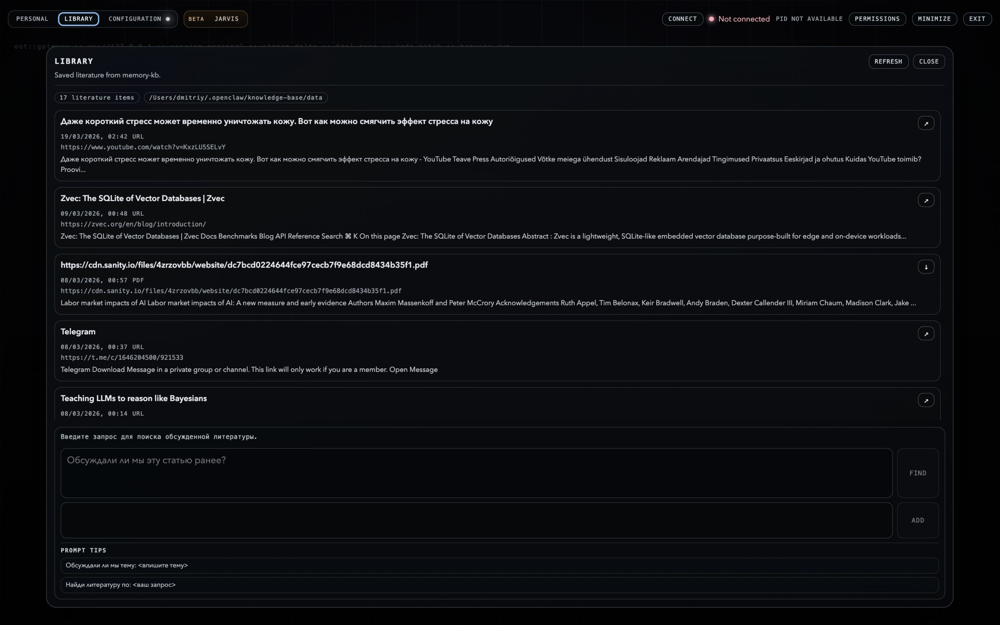

# Knowledge Base

`core/knowledge-base/` is the bot's local knowledge base. It acts as long-term research memory: it stores materials, splits them into parts, indexes them, and later helps recover the right context quickly.

## What It Does

This module can:

- store articles, links, PDFs, and plain text materials;
- split them into chunks;
- build embeddings for them;
- find relevant fragments later through natural-language search.

## How I Use It In Practice

- in Telegram, I send the bot a link, article, or document;
- the material is saved to the knowledge base automatically or manually;
- the text is split into chunks and indexed;
- later I can ask the bot about that topic at any time, and it quickly pulls the needed context from local memory.

This capability is also exposed in the UI through the `Library` tab, where saved materials can be browsed and used as a personal research library.



## Which Model Is Used

This module uses a local embedding model:

| Parameter | Value |
|---|---|
| Model | `Xenova/multilingual-e5-small` |
| Type | multilingual embedding model |
| Vector size | `384` |
| Languages | RU + EN plus other multilingual scenarios |
| Runtime mode | fully local, no API keys required |

## Where The Data Lives

The vector layer and the database are structured as follows:
- `zvec` is used as the local vector store;
- `zvec` is used as the local vector store;
- SQLite stores entries, metadata, and chunks;
- vectors and metadata are used together during retrieval.

## Technical Parameters

| Parameter | Value |
|---|---|
| `embeddingDim` | `384` |
| `chunkSize` | `500` |
| `chunkOverlap` | `50` |
| `database path` | `~/.openclaw/knowledge-base/data/knowledge.db` |
| `collection metric` | `cosine similarity` |
| `index type` | `flat` |

## How It Works

```text
URL / PDF / text / local file
        │
        ▼
  ingest.js
        │
        ├── extracts text
        ├── splits into chunks
        ├── builds embeddings
        ├── stores metadata in SQLite
        └── stores vectors in zvec
                 │
                 ▼
            query.js
                 │
                 ├── builds the query embedding
                 ├── runs semantic search
                 └── returns the best chunks
```

## Structure

```text
core/knowledge-base/
├── ingest.js      — add URLs, PDFs, text, and files to the knowledge base
├── query.js       — semantic querying against the knowledge base
├── list.js        — list saved materials
├── delete.js      — delete an entry from the database
├── embed.js       — local embedding logic
├── db.js          — SQLite + zvec layer
├── kb.config.json — model, chunking, and dataDir parameters
└── SKILL.md       — rules for using the knowledge base inside OpenClaw
```

## Examples

### After Ingestion

```text
✓ Added to knowledge base: Title of Article (12 chunks)
```

### During Search

```text
1. [84.4% match] Article Title
   Source: https://example.com
   Tags:   finance, notes
   ---
   Excerpt from the matched chunk...
```

### While Viewing The Library

```text
Knowledge Base - 18 entries, 146 total chunks
```
